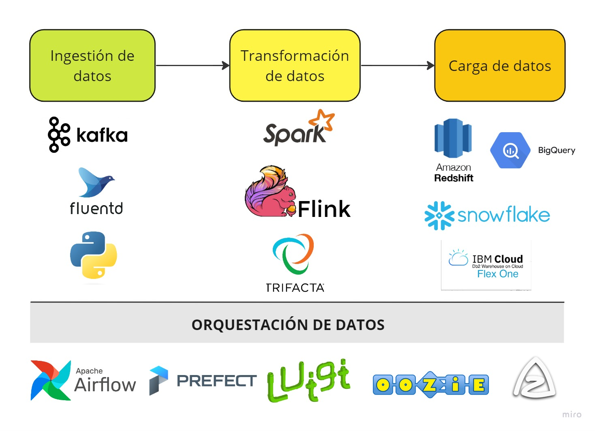

# Ingeniería de Datos

## 1. Desarrollo Conceptual

### 1.1. Concepto
La ingeniería de datos es el proceso de recopilar, almacenar y preparar datos para que puedan ser utilizados por otros especialistas en una organización. Los ingenieros de datos son los responsables de diseñar y construir sistemas que permitan a las empresas recopilar datos de diversas fuentes, almacenarlos de forma eficiente y prepararlos para su análisis.

### 1.2. Etapas del flujo de Ingeniería de Datos

El procedimiento de ingeniería de datos engloba una secuencia de operaciones destinadas a convertir una extensa cantidad de datos en bruto en un producto funcional que cumple con los requisitos de analistas, científicos de datos e ingenieros de aprendizaje automático, entre otros. Generalmente, el flujo de trabajo completo consta de las siguientes etapas.

- **La fase de ingestión de datos (adquisición):** Transfiere los datos desde diversas fuentes, como bases de datos SQL y NoSQL, dispositivos IoT, sitios web, servicios de streaming, etc., hacia un sistema de destino para ser procesados posteriormente. Los datos presentan diversas formas y pueden ser tanto estructurados como no estructurados.

- **La fase de transformación de datos**: Adapta los datos heterogéneos a las necesidades de los usuarios finales. Esto implica la eliminación de errores y duplicados, la normalización y la conversión al formato requerido.

- **La fase de distribución de datos**: Distribuye los datos transformados a los usuarios finales, ya sea a través de una plataforma de BI, un panel de control o un equipo de ciencia de datos.

- **La orquestación del flujo de datos** proporciona visibilidad en el proceso de ingeniería de datos, garantizando que todas las tareas se completen con éxito. Coordina y realiza un seguimiento continuo de los flujos de trabajo de datos para detectar y solucionar problemas de calidad y rendimiento de los datos.

### 1.3. Data Pipeline

Un *data pipeline* combina herramientas y operaciones que mueven datos de un sistema a otro para su almacenamiento y posterior tratamiento. Construir y mantener *data pipelines* es la principal responsabilidad de los ingenieros de datos. Entre otras cosas, escriben secuencias de comandos para automatizar tareas repetitivas.

Normalmente, los *pipelines* se utilizan para:

- la migración de datos entre sistemas o entornos (de bases de datos locales a bases de datos en la nube).
- gestión de datos o conversión de datos sin procesar en un formato utilizable para proyectos de análisis, BI y aprendizaje automático.
- integración de datos de varios sistemas y dispositivos IoT.
- copia de tablas de una base de datos a otra.




### 1.4. Apache Airflow

Apache Airflow es una herramienta de orquestación de flujos de trabajo que se ha vuelto esencial en el ámbito de la ingeniería de datos. En proyectos de data engineering, la gestión y ejecución de flujos de datos complejos, que involucran extracción, transformación y carga (ETL) de datos, se vuelve crucial para garantizar la integridad y eficiencia del pipeline.

Airflow permite la definición y programación de flujos de trabajo ETL de manera eficiente, ayudando a coordinar y ejecutar tareas de extracción, transformación y carga de datos de manera estructurada y automatizada.

Algunos conceptos básicos de Airflow son:

- **DAG (Directed Acyclic Graph)**: Un DAG es un gráfico dirigido acíclico que representa el flujo de trabajo en Airflow. Cada nodo en el gráfico representa una tarea, y las aristas definen las dependencias entre las tareas.

- **Tarea (Task)**: Una tarea en Airflow es una unidad de trabajo individual en el contexto de un DAG. Puede ser cualquier operación o conjunto de operaciones, como ejecutar un script, realizar una consulta a una base de datos, enviar un correo electrónico, etc.

- **Operador (Operator)**: Un operador define la lógica de una tarea específica. Hay operadores predefinidos para tareas comunes (por ejemplo, PythonOperator, BashOperator, SQLOperator), y los usuarios pueden crear sus propios operadores personalizados.

- **Scheduler**: El scheduler es el componente de Airflow que programa las ejecuciones de las tareas de acuerdo con sus dependencias y horarios definidos en el DAG.


## 2. Consideraciones Técnicas

Algunos prerrequisitos a tener instalados son:
- Visual Studio Code
- Docker Desktop
- La extensión de Docker en VS Code
- La extensión de Python en VS Code

### 2.1. Instalación / Configuración de Servicio
Actualmente, Apache Airflow no es directamente compatible con Windows, como se explicará más adelante, por lo que vamos a utilizar la tecnología de contenedores para desplegarlo, en este caso, Docker.

La documentación de Apache Airflow se encuentra en el siguiente link: [Apache Airflow Documentation](https://airflow.apache.org/docs/)
Para más información de cómo ejecutar Airflow en Docker, ir a este link: [Runnind Airflow in Docker](https://airflow.apache.org/docs/apache-airflow/stable/howto/docker-compose/index.html).

#### PASO 1: Actualizar el Subsistema de Windows para Linux
Apache Airflow es compatible con Windows solo a través de WSL (Windows Subsystem for Linux). WSL es una capa de compatibilidad que permite ejecutar aplicaciones de Linux en Windows.

Al actualizar el WSL, se actualiza el kernel de Linux que se usa con WSL. El kernel es el componente central de un sistema operativo Linux, y es el responsable de la gestión de los recursos del hardware y de la ejecución de los procesos.

En una línea de comandos de cmd, ejecutar:

```
> wsl --update
```
#### PASO 2: CREAR UN PROYECTO

Los pasos para crear un proyecto son:
1. Crear una carpeta vacía y abrirla en el espacio de trabajo de Visual Studio Code.
2. **Visual Studio**: 

    2.1. Crear un archivo llamado: *dockerfile* y colocar el siguiente código, que es básico para cualquier proyecto:

    ```dockerfile
    FROM apache/airflow:latest

    USER root
    RUN apt-get update && \
        apt-get -y install git && \
        apt-get clean

    USER airflow
    ```

    Este archivo Dockerfile crea una imagen de Docker que se basa en la imagen oficial de Apache Airflow más reciente, instala el paquete git y cambia el usuario predeterminado a Airflow. La documentación de la imagen de Apache Airflow en Docker se encuentra en el siguiente link: [Docker Image for Apache Airflow](https://airflow.apache.org/docs/docker-stack/index.html)

    2.2. Construir la imagen de Apache Airflow. Clic derecho al archivo *dockerfile* y clic en "Build Image"

    La consola mostrará lo siguiente:
    


    2.3. 

    
### 2.2. Primeros pasos


## 3. Demo

### 3.1. Escenario práctico

### 3.2. Pasos para la demo

### 3.3. Resultados