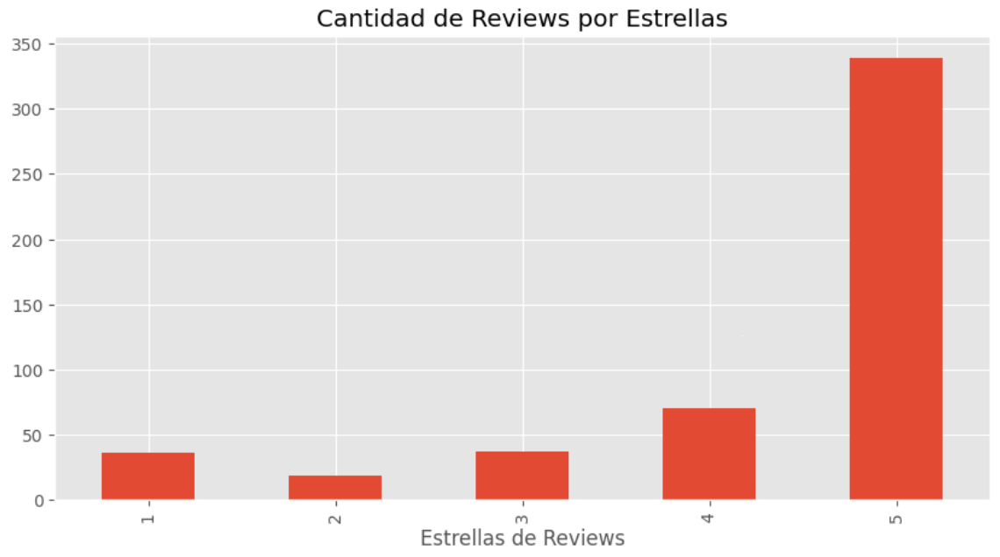
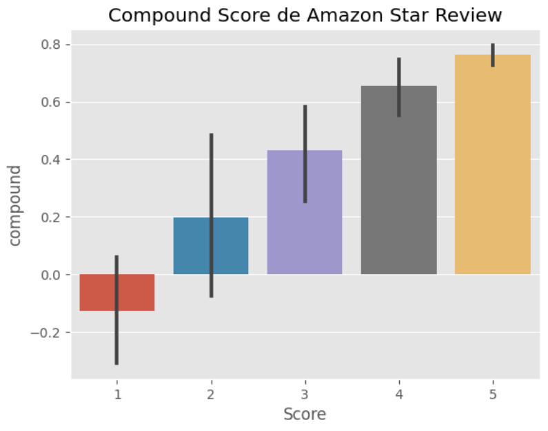

# NLP

## 1. Introducción

La Procesamiento del Lenguaje Natural (NLP, por sus siglas en inglés) se refiere a la interacción entre las computadoras y el lenguaje humano. Es una rama de la inteligencia artificial que se ocupa de la capacidad de las máquinas para comprender, interpretar y generar texto en lenguaje humano de una manera que sea valiosa.

La NLP busca capacitar a las computadoras para entender el lenguaje humano en sus formas habladas o escritas, de manera que puedan realizar tareas útiles. Estas tareas pueden incluir desde la traducción automática y el análisis de sentimientos hasta la generación de texto y la conversación con chatbots.

Es importante porque el más grande repositorio del conocimiento humano se encuentra en textos y sigue creciendo cada minuto.

## 2. Historia del NLP 

- 1950: Alan Turing propone Test de Turing como criterio de inteligencia

**PNL SIMBÓLICA (1950's - 1990's)**
- **1954**: Experimento de Georgetown-IBM: traducción automática de frases rusas al inglés. Gana interés la ligüística computacional.
- **1960**: SHRDLU (MIT) y ELIZA
    - Identificación de palabras clave,
    - Elección de transformaciones apropiadas
    - Generación de respuestas adecuadas o la capacidad de reaccionar ante la ausencia de palabras críticas.
- **1970**: Se estructuraba la información del mundo real en datos comprensibles al ordenador (MARGIE, SAM, PAM, TaleSpin, QUALM, Politics, Plot Units, chatterbot: PARRY)

- **1980s**: Apogeo de métodos simbólicos
    - Análisis sintáctico basado en reglas (HPSG)
    - Morfología (morfología de dos niveles)
    - Semántica (algoritmo de Lesk, para entender la ambigüedad semántica)
    - Referencia (Teoría de la Estructura Retórica, para entender las relaciones entre los componentes de una oración)
    - Se continuó mejorando chatterbots: Racter y Jabberwacky

**PNL ESTADÍSTICA (1990s-2000s)**

- Aumento de técnicas de Machine Learning
- Aumento de potencia de cálculo (ley de Moore)
- Debilitamiento de ideas chomskianas
- **1990s**: Traducción automática
    - Entrenamiento a partir de pocos datos
- **2000s**: ML semisupervisado y no supervisado debido a datos no anotados en la WWW.

**PNL NEURONAL (2000s-actual)**
- **2003**: Modelo n-gramas (secuencias de n palabras que aparecen juntas en un texto) superado por perceptron multicapa
- **2010**: Tomáš Mikolov propone red neuronal recurrente simple con una sola capa oculta al modelado del lenguaje y luego, plantea Word2vec.

## 3. VISTA DE LOS TRES ENFOQUES

El enfoque simbólico fue el primer enfoque en PNL y la base en la que se fundaron los otros dos. Su característica es que necesita reglas tanto para los casos comunes como para los casos raros, y gana precisión aumentando el número y complejidad de reglas, esto supone aumentar e identificar las reglas para los casos erróneos, lo que lo hace más difícil de implementar. Actualmente, se encuentran casi obsoletos desde la aparición de los Large Language Models.

El enfoque estadístico puso fin a un periodo de invierno en PNL por los años 80, debido al estancamiento de los modelos simbólicos. Se ven representados por la introducción de los modelos ocultos de Markov (que deja a un lado los árboles de decisión de tipo if-then).

El enfoque neuronal empieza a usar modelos de machine learning semisupervisado y supervisado debido a la cantidad de datos generados desde inicios del milenio. Usa embedding (incrustaciones de palabras) para capturar propiedades semánticas de las palabras, lo que permite eliminar pasos intermedios, como etiquetado de partes del discurso o análisis sintáctico de dependencias.

Estos dos últimos enfoques se centran más en los casos comunes extraídos de un corpus de textos, por lo tanto, son más resistentes a las entradas erróneas.

## 4. Tareas del NLP

- Semántica léxica
    - Reconocimiento de entidades con nombre (NER) (nombres propios, lugares) o clasificación de tokens
    - Análisis de sentimiento: identificar polaridad
    - Desambiguación de sentido de palabras (sentido de las palabras según contexto, usa diccionario)

- Análisis morfológico
    -  Lematización
    - Segmentación morfológica
    - Etiquetado de partes del discurso (para entender ambigüedades)
    - Stemming

- Análisis sintáctico
    - Inducción gramatical
    - Sentence breaking
    - Parsing

- Semántica relacional
    - Extracción de relaciones
    - Análisis semántico

- Tareas avanzadas de NLP
    -  Resumen de textos automáticos
    - Corrección de errores gramaticales
    - Traducción automática
    - Generación de lenguaje natural
    - Generación de libros
    - Responder preguntas
    - Generación de texto a imágenes
    - Generación de texto a escenas 3D
    - Generación de texto a video

## 5. Consideraciones Técnicas

Algunos prerrequisitos a tener instalados son:
- Python 3.0
- Jupyter Notebook o usar Google Colab (IDE)


## 6. DEMO

Para el caso práctico, se hará un análisis de sentimientos de reseñas de *Fine Food* en Amazon utilizando la herramienta NLTK (Natural Language Toolkit)

#### 1. Descargar dataset de reseñas de Amazon: https://www.kaggle.com/code/varadahirwadkar/starter-amazon-fine-food-reviews-503caf78-5 

#### 2. Descargar las librerías:
    ```python
        import pandas as pd
        import numpy as np
        import matplotlib.pyplot as plt
        import seaborn as sns
        plt.style.use('ggplot')
        import nltk
    ```

#### 3. Se carga el archivo csv, se realiza lectura e inspección de la data.
    ```python
        df = pd.read_csv('/content/amazon-fine-food-reviews/Reviews.csv')
        print(df.shape)
    ```

#### 4. Análisis Exploratorio de Datos: Se observa que principalmente son comentarios con 5 estrellas.

    

#### 5. Modelo Vader
Usa Bag of Words. No considera relaciones entre palabras. Se remueven stop words. Se califica cada palabra y se calcula un promedio.

    ```python
    for i, row in tqdm(df.iterrows(), total=len(df)):
        text = row['Text']
        myid = row['Id']
        res[myid] = sia.polarity_scores(text)
    ```

Graficamos los resultados de vader en gráfico de barras, y observamos que los comentarios con 5 estrellas tienen un compound* positivo, mientras que los comentarios con 1 estrella tienen un compound de 0 a menos.

*compound*: nivel de polaridad de un comentario.




#### 6. Modelo Roberta
Usa un modelo entrenado con una data extensa. Considera el contexto de las otras palabras.

Librerías utilizadas
```python
from transformers import AutoTokenizer
from transformers import AutoModelForSequenceClassification
from scipy.special import softmax
```

Se realiza Transfer Learning:
```python
MODEL = f"cardiffnlp/twitter-roberta-base-sentiment"
tokenizer = AutoTokenizer.from_pretrained(MODEL)
model = AutoModelForSequenceClassification.from_pretrained(MODEL)
```

Se define la función:

```python
def polarity_scores_roberta(example):
    encoded_text = tokenizer(example, return_tensors='pt')
    output = model(**encoded_text)
    scores = output[0][0].detach().numpy()
    scores = softmax(scores)
    scores_dict = {
        'roberta_neg' : scores[0],
        'roberta_neu' : scores[1],
        'roberta_pos' : scores[2]
    }
    return scores_dict
```

#### 7. Resultados de la comparación
Del gráfico siguiente, se concluye que el modelo Roberta tiene mejores resultados, dada una mejor concentración de datos en determinado punto, ya sea para positivos, neutrales o negativos, mientras que Vader tiene mayor dispersión de sus datos.


