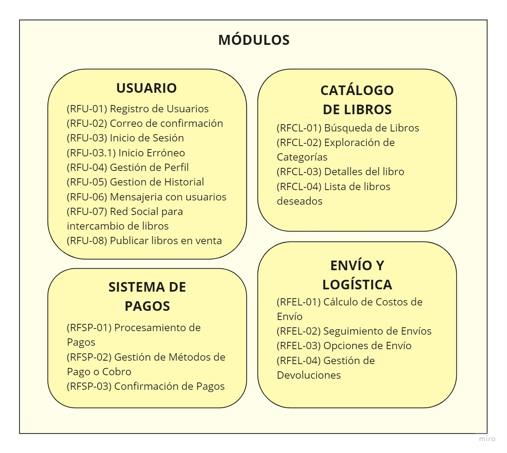

# CASO DE NEGOCIO

## LISTA DE PENDIENTES

- [ ] Crear los mockups de la plataforma web
- [ ] Definir cuáles serán los módulos
- [ ] <b>Estructura</b>
    - [ ] <b>Caso de Negocio</b>
        - [ ] Generalidades :  Bri
        - [ ] Modelo de Negocio : Bri
        - [ ] Estructura del equipo
        - [ ] Listado de Stakeholders
    - [ ] <b>Requerimientos del Sistema</b> (deben ser por módulo, si hay req. transversales, definirlos tmbn) 
        - [ ] <b>Requerimientos Funcionales</b>: Acotar o ampliar funcionalidad de soluciones tradicionales. Respaldados por mockups o prototipos.
        - [ ] <b>Requerimientos de Atributos de Calidad (Escenarios)</b>: Además de su relación con los req. de sistema.
        - [ ] <b>Restricciones</b>: Factores sobre los que no hay influencia directa.
    - [ ] <b>Decisiones a nivel de arquitectura</b>: Usar categorías vistas en el curso.
        - [ ] <b>Asignación de Responsabilidades</b> 
        - [ ] <b>Modelo de Coordinación</b>
        - [ ] <b>Modelo de Datos</b>
        - [ ] <b>Mapeo entre Elementos de Arquitectura</b>
        - [ ] <b>Elección de Tecnología</b>
    - [ ] <b>Tácticas </b>: A nivel de disponibilidad, mantenibilidad, interoperabilidad, rendimiento, seguridad
    - [ ] <b>Tópicos en Arquitectura de SW (Cada uno) </b>: Se coloca como anexo. Se elabora un video explicativo y mostrando código de demo.
        - [ ] Desarrollo conceptual
        - [ ] Consideraciones técnicas: instalación y configuración
            - [ ] Instalación / Configuración de Servicio
            - [ ] Primeros pasos
        - [ ] <b>Demo</b>
            - [ ] Escenario práctico
            - [ ] Pasos para la demo

## 1. Bookswap

### a. Generalidades
El libro es un bien cultural que ha acompañado a la humanidad durante siglos. En Perú, el libro es un producto de consumo masivo, con un mercado de más de 10 millones de lectores. Sin embargo, existe un vacío en el mercado para la compra y venta de libros de segunda mano. La venta de libros en el Perú ha aumentado a pesar de la pandemia del COVID-19 y el aislamiento social, según Desafíos PWC (2022), el mercado ha crecido un 8% interanual para el año 2020, y 4.9% para el 2021, además de que seamos el segundo país en América Latina con mayor crecimiento en compra de libros impresos.

La feria de libros en el Jirón Amazonas ofrece una experiencia única para los lectores que buscan libros usados. Sin embargo, la falta de una plataforma online centralizada para comprar y vender libros usados limita las posibilidades de compra y venta de este tipo de libros.

Existen, no obstante, plataformas web que realizan la tarea de interconectar a vendedores de libros de segunda mano (que en realidad puede ser cualquier persona que quiera ofrecer un libro que ya no va a usar más). Buscalibre es una librería online con sede en Chile cuya especialidad es la venta de libros, tanto usados como nuevos, a un precio variado y con un costo de envío bajo, aunque sean libros importados desde Europa o cualquier país de Latinoamérica. Sin embargo, la funcionalidad de compra de libros usados no está muy desarrollada, ya que los precios son colocados por la plataforma de acuerdo con el ISBN de cada libro (Buscalibre, s.f.), por lo tanto, si son muy altos y no van de acuerdo con el valor real del libro, no se venden. Relibrea es una plataforma web que conecta a vendedores y compradores de libros de segunda mano, sin embargo, solo es un punto de encuentro entre ambas partes, las negociaciones son definidas por los usuarios, y no tiene mayor funcionalidad especial.

El objetivo de este trabajo es proponer una plataforma web para la compra y venta de libros de segunda mano en Perú. La plataforma facilitará la compra y venta de libros de segunda mano, ya que los usuarios encontrarán los libros que buscan de forma rápida y sencilla, y que ofrecería un sistema de pago seguro y confiable. Adempas, contribuiría a la economía circular. La venta de libros de segunda mano ayuda a reducir el impacto ambiental de la industria editorial, ya que evita la producción de libros nuevos. Finalmente, fomentaría la cultura de la lectura. Al hacer que los libros sean más accesibles, la plataforma podría ayudar a fomentar el hábito de la lectura entre los peruanos.

### b. Modelo de Negocio

El modelo de negocio se basa en las siguientes características:

#### 1. Segmentos de Clientes
- <b>Lectores Aficionados</b>: Personas que buscan libros a precios más accesibles y desean contribuir a la economía circular.
- <b>Vendedores Particulares</b>: Individuos que quieren vender libros usados que ya no necesitan.
- <b>Pequeñas Librerías Locales</b>: Establecimientos que desean ampliar su alcance vendiendo libros de segunda mano.

#### 2. Propuesta de Valor

- <b>Variedad de Libros Usados</b>: Una amplia gama de libros de segunda mano disponibles.
- <b>Sistema de Pago Seguro</b>: Con un proceso de pago seguro, los usuarios pueden comprar y vender con confianza, protegiendo la privacidad de sus datos financieros.
- <b>Economía Circular</b>: Al promover la reutilización, ayudamos a reducir la demanda de nuevos libros y, por ende, el impacto ambiental asociado a su producción.
- <b>Fomento de la Lectura</b>: Hace que los libros sean más accesibles, fomentando el hábito de la lectura.

#### 3. Canales

- <b>Plataforma Web</b>: La principal interfaz para usuarios.
- <b>Correo Electrónico</b>: Confirmación de registros, notificaciones de transacciones y actualizaciones.
- <b>Redes Sociales</b>: Promoción, publicidad y participación de la comunidad.

#### 4. Relaciones con los clientes

- <b>Atención al Cliente</b>: Soporte a través de correo electrónico.
- <b>Comunidad en Línea (**)</b>: Foros, reseñas y espacio para que los usuarios compartan sus experiencias.

#### 5. Fuentes de ingresos

- <b>Comisión por Transacción</b>: Pequeña tarifa por cada venta realizada a través de la plataforma.
- <b>Publicidad Premium (**)</b>: Oportunidades para destacar ciertos libros o vendedores mediante publicidad pagada.

#### 6. Recursos clave

- <b>Plataforma Web</b>: Desarrollo y mantenimiento continuo.
- <b>Base de Datos de Libros</b>: Actualizada y diversa.
- <b>Sistema de Pago Seguro</b>: Integración con pasarelas de pago confiables.

#### 7. Actividades clave

- <b>Curación de Contenido</b>: Garantizar la calidad y autenticidad de los libros en la plataforma.
- <b>Desarrollo y Mejora Continua de la Plataforma</b>: Para adaptarse a las necesidades cambiantes de los usuarios.

#### 8. Socios clave

- <b>Servicios de Pago</b>: Colaboración con proveedores de servicios de pago seguros.
- <b>Empresas de Logística</b>: Acuerdos para el envío eficiente y seguimiento de pedidos.
- <b>Proveedores Frecuentes de Libros de Segunda Mano</b>: Para mantener un flujo constante de nuevos libros en la plataforma.

#### 9. Estructura de costos

- <b>Desarrollo y Mantenimiento de la Plataforma</b>: Incluyendo actualizaciones y mejoras.
- <b>Gastos de Marketing</b>: Publicidad en línea y promoción para atraer nuevos usuarios.
- <b>Costos de Transacción</b>: Relacionados con el procesamiento seguro de pagos.

### c. Estructura del equipo

En la siguiente sección, se delinearán los elementos fundamentales de la estructura organizativa del equipo dedicado a la venta de libros de segunda mano. 

#### CEO
Se encuentra en el primer nivel y es el encargado de establecer la visión y estrategia general de la empresa. También se encarga de tomar decisiones estratégicas, elegir las tácticas y representar a la empresa ante socios clave y eventos importantes.

#### COO
El Director de Operaciones supervisa las operaciones diarias y garantiza la eficiencia, gestiona la logística y el cumplimiento de pedidos, además de que, al ser parte de la dirección ejecutiva, colabora en la toma de decisiones estratégicas.

#### CTO
El Director de Tecnología es un rol clave. Supervisa el desarrollo y mantenimiento de la plataforma web, garantiza que la plataforma sea segura tanto para compradores como vendedores, y al ser parte de la dirección ejecutiva, también colabora en la toma de decisiones estratégicas.

#### EQUIPOS FUNCIONALES
Los equipos funcionales se centran en tareas y actividades especializadas directamente relacionadas con la misión principal de la empresa.

| Equipo | Descripción |
| -----------|----------|
| Desarrollo | Desarrollar  y mantener la plataforma web. Implementar nuevas características y mejoras |
| Operaciones y Logística | Gestionar la logística y envío de libros. Coordinar con empresas de logística y proveedores. |
| Marketing | Desarrollar estrategias de marketing y publicidad. Gestionar campañas en redes sociales. |
| Contenido y Curación | Verificar la autenticidad y calidad de los libros. Desarrollar descripciones detalladas para los libros. Mantener calidad del catálogo |

#### EQUIPOS DE SOPORTE
Los equipos de soporte brindan servicios que respaldan las funciones principales de la organización, sin estar directamente relacionados en el servicio principal.
| Equipo | Descripción |
| -----------|----------|
| Atención al Cliente | Responder a consultas de usuarios. Gestionar problemas y solicitudes. |
| Comunidad ** | Fomentar la participación en la comunidad. Gestionar foros y contenido generado por usuarios. |

#### FINANZAS Y ADMINISTRACIÓN
Este equipo se centra en la gestión financiera y administrativa de la empresa. Está encargado de la planificación financiera, la contabilidad, la gestión de recursos humanos y otras funciones administrativas cruciales para el buen funcionamiento de la organización.
| Equipo | Descripción |
| -----------|----------|
| CFO | Supervisar salud financiera de la empresa. Gestionar presupuestos. Colabora en decisiones estratégicas. |
| Equipo Administrativo | Gestionar tareas administrativas y recursos humanos. Cumplir con requisitos legales. |

### d. Listado de Stakeholders
Los stakeholders seleccionados para este trabajo son:
|Stakeholder|Funciones|
|-------------|-----------|
| Usuario | Representa a los posibles compradores y vendedores de libros en la plataforma. Contribuye con la definición de requisitos, proporciona retroalimentación sobre la usabilidad y la experiencia del usuario, y ayuda a dar forma a las características que satisfacen sus necesidades en la compra y venta de libros de segunda mano.|
|Jefe de proyecto| Dirige la planificación y ejecución del proyecto de la plataforma de venta de libros usados. Gestiona el equipo de desarrollo, asegura que se cumplan los plazos, y supervisa la implementación de características centradas en la experiencia del usuario y la eficiencia operativa. | 
| Administrador de Base de Datos| Diseña y gestiona la estructura de la base de datos que almacena la información sobre los libros y los usuarios. Garantiza la integridad y seguridad de los datos, así como la eficiencia en la recuperación de la información.|
|Diseñador | Trabaja en la interfaz de usuario de la plataforma. Diseña una experiencia atractiva y fácil de usar que fomente la navegación fluida, la presentación clara de los libros y la participación activa de los usuarios. |
|Implementador| Transforma los diseños y requisitos en código funcional para la plataforma. Desarrolla las características que permitirán la compra y venta de libros de manera efectiva y segura. |
|Especialista en Despliegue| Gestiona la implementación de la plataforma en entornos de producción. Se asegura de que el despliegue sea exitoso y que la plataforma esté disponible para los usuarios finales. |
|Responsable de pruebas | Diseña y ejecuta pruebas para identificar posibles problemas en la plataforma. Colabora con los desarrolladores para corregir errores, garantizando que la plataforma sea robusta y segura para los usuarios.| 
|Responsable de Mantenimiento| Supervisa las actualizaciones y mejoras continuas de la plataforma después de su lanzamiento. Aborda problemas en curso y trabaja para optimizar la plataforma a medida que evolucionan las necesidades y tecnologías. |
|Ingeniero de sistemas| Colabora en el diseño y la arquitectura de la plataforma. Asegura que la infraestructura técnica sea escalable y cumpla con los estándares de seguridad, contribuyendo a la viabilidad y robustez del sistema. |

## 2. Requerimientos

### 2.1. Requerimiento funcionales

#### 2.1.1. Usuario (Alex)

- **Registro de Usuarios (RFU-01)**: Los usuarios deben poder registrarse en la plataforma proporcionando información como nombre, dirección de correo electrónico y contraseña.
- **Correo de confirmación (RFU-02)**: Los usuarios recibiran un correo electrónico de confirmación para verificar la dirección de correo electrónico del usuario.
- **Inicio de Sesión (RFU-03)**: Los usuarios registrados deben poder iniciar sesión en sus cuentas utilizando su correo electrónico y contraseña.
- **Inicio Erróneo (RFU-03.1)**: Los usuarios en caso ingresen credenciales incorrectas, el sistema debe mostrar un mensaje de error, indicando que ingresen correctamente sus credenciales.
- **Gestión de Perfil (RFU-04)**: Los usuarios pueden editar su perfil, incluyendo información personal como nombre, dirección , contraseña y foto de perfil.
- **Gestion de Historial (RFU-05)**: Los usuarios pueden ver y editar su historial de intercambio de libros.
- **Mensajeria con usuarios (RFU-06)**: Los usuarios pueden enviar mensajes privados a los potenciales compradores/vendedores. 
- **Red Social para intercambio de libros (RFU-07)**: Los usuarios van a poder subir publicaciones en su página principal de los libros que les gusta o para ofrecer un intercambio, se podra dar me gusta a las publicaciones y comentar los posts, además se podrá agregar amigos.
 - **Publicar libros en venta (RFU-08)** </b>: Los usuarios pueden subir la información de los libros que quieren vender.

#### 2.1.2. Catálogo de libros (Bri)

- **Búsqueda de Libros (RFCL-01)**: Los usuarios deben poder buscar libros en la plataforma utilizando filtros como título, autor, género, ubicación.
- **Exploración de Categorías (RFCL-02)**: Los usuarios deben poder navegar y explorar diferentes categorías de libros para descubrir nuevas lecturas.
- **Detalles del libro (RFCL-03)**: Los usuarios pueden ver información detallada sobre un libro, incluyendo su descripción, precio, estado y la ubicación del vendedor.
- **Lista de libros deseados (RFCL-04)**: Los usuarios deben poder agregar libros a su lista de deseos.

#### 2.1.3. Sistema de pagos (Daniel)

- **Procesamiento de Pagos (RFSP-01)**: El sistema debe ser capaz de procesar pagos de manera segura y confiable cuando los usuarios realicen compras.
- **Gestión de Métodos de Pago o Cobro (RFSP-02)**: Los usuarios pueden agregar, editar o eliminar métodos de pago o cobro, como tarjetas de crédito o cuentas bancarias.
- **Confirmación de Pagos (RFSP-03)**: Los usuarios deben recibir una confirmación de pago exitoso después de realizar una compra o intercambio.

#### 2.1.4. Envío y logísticas (Micali)

- **Cálculo de Costos de Envío (RFEL-01)**: El sistema debe calcular los costos de envío para los compradores en función de la ubicación del vendedor y el comprador.
- **Seguimiento de Envíos (RFEL-02)**: Los usuarios deben poder realizar un seguimiento de los envíos en tiempo real y recibir actualizaciones sobre la ubicación y el estado de la entrega.
- **Opciones de Envío (RFEL-03)**: Los vendedores pueden ofrecer diferentes opciones de envío, como envío estándar o express, para que los compradores elijan.
- **Gestión de Devoluciones (RFEL-04)**: Los usuarios deben poder solicitar devoluciones y gestionar el proceso de devolución de libros si el producto no cumple con las expectativas.

### 2.2. Requerimiento de atributos de calidad (Escenarios)

(RFEL-01) Cálculo de Costos de Envío: El sistema debe calcular los costos de envío para los compradores en función de la ubicación del vendedor y el comprador.

(RFEL-02) Seguimiento de Envíos: Los usuarios deben poder realizar un seguimiento de los envíos en tiempo real y recibir actualizaciones sobre la ubicación y el estado de la entrega.

(RFEL-03) Opciones de Envío: Los vendedores pueden ofrecer diferentes opciones de envío, como envío estándar o express, para que los compradores elijan.

(RFEL-04) Gestión de Devoluciones: Los usuarios deben poder solicitar devoluciones y gestionar el proceso de devolución de libros si el producto no cumple con las expectativas.

### 2.2 Flujo de Interacción de la Plataforma BookSwap: (Flujo Principal)

1. Los usuarios acceden a la página de inicio de BookSwap.
2. Los nuevos usuarios hacen clic en "Registro de Usuario" (RFU-01) y proporcionan su nombre, dirección de correo electrónico y contraseña.
3. Después de completar el registro, se envía un correo de confirmación (RFU-02) para verificar la dirección de correo electrónico.
4. Los usuarios registrados pueden iniciar sesión utilizando su correo electrónico y contraseña en "Inicio de Sesión" (RFU-03). En caso de ingreso erróneo de credenciales, se muestra un mensaje de error (RFU-03.1).
5. Los usuarios pueden editar su perfil, incluyendo información personal como nombre, dirección, contraseña y foto de perfil en "Gestión de Perfil" (RFU-04).
6. Los usuarios pueden ver y editar su historial de intercambio de libros en "Gestión de Historial" (RFU-05).
7. Los usuarios pueden enviar mensajes privados a otros usuarios interesados en comprar/vender libros en "Mensajería con Usuarios" (RFU-06).
8. Los usuarios pueden participar en una "Red Social para Intercambio de Libros" (RFU-07). Pueden subir publicaciones sobre libros que les gustan o para ofrecer un intercambio. Pueden dar me gusta, comentar y agregar amigos.
9. Para vender libros, los usuarios pueden utilizar "Publicar Libros en Venta" (RFU-08), donde suben la información de los libros que desean vender.
10. Los usuarios pueden buscar libros en la plataforma utilizando filtros como título, autor, género y ubicación en "Búsqueda de Libros" (RFCL-01).
11. Los usuarios pueden navegar y explorar diferentes categorías de libros para descubrir nuevas lecturas en "Exploración de Categorías" (RFCL-02).
12. Los usuarios pueden ver información detallada sobre un libro, incluyendo su descripción, precio, estado y ubicación del vendedor en "Detalles del Libro" (RFCL-03).
13. Los usuarios pueden agregar libros a su lista de deseos en "Lista de Libros Deseados" (RFCL-04).
14. El sistema procesa pagos de manera segura y confiable durante las compras o intercambios en "Procesamiento de Pagos" (RFSP-01).
15. Los usuarios pueden agregar, editar o eliminar métodos de pago o cobro, como tarjetas de crédito o cuentas bancarias en "Gestión de Métodos de Pago o Cobro" (RFSP-02).
16. Después de realizar una compra o intercambio, los usuarios reciben una confirmación de pago exitoso en "Confirmación de Pagos" (RFSP-03).
17. El sistema calcula los costos de envío para los compradores en función de la ubicación del vendedor y del comprador en "Cálculo de Costos de Envío" (RFEL-01).
18. Los usuarios pueden realizar un seguimiento de los envíos en tiempo real para recibir actualizaciones sobre la ubicación y el estado de la entrega en "Seguimiento de Envíos" (RFEL-02).

### 2.3 Requerimientos de Atributos de Calidad (Escenarios)
A continuación, se presenta una tabla que resume los atributos de calidad, sus descripciones y los escenarios asociados:

|Atributo|Código|Entorno|Fuente|Estímulo|Artefacto|Resouesta|Medida de Respuesta
|-------------|-----------|-----------|-----------|-----------|-----------|-----------|-----------|
|Escalabilidad|ESC-01|Red Social|Usuario|Miles de publicaciones en un periodo corto | Infraestrucutra de servidores|Activación de servidores extras|El servidor se activa de 30 segundos
| Escalabilidad | ESC-02 | Plataforma de Bookswap | Usuario | Aumento rápido de usuarios y transacciones | Infraestructura del servidor | Escalamiento automático de recursos computacionales | El tiempo de respuesta se mantiene constante incluso con el aumento del tráfico. |
| Disponibilidad | ESC-03 | Base de Datos | Usuario | Fallo del servidor principal | Base de datos replicada | Conmutación por error a la réplica de la base de datos | La plataforma sigue funcionando sin interrupciones. |
| Usabilidad | ESC-04 | Interfaz de Usuario | Usuario | Interacción del usuario con la interfaz | Interfaz de usuario | Respuestas intuitivas y guías visuales | La tasa de abandono durante el registro y la búsqueda se reduce en un 20%. |
| Seguridad | ESC-05 | Procesos de Autenticación | Usuario | Intento de inicio de sesión no autorizado | Sistema de autenticación | Bloqueo temporal de la cuenta y notificación al usuario | La cuenta del usuario está segura y el acceso no autorizado se detiene. |
| Eficiencia | ESC-06 | Sistema de Pago | Usuario | Procesamiento de transacciones | Módulo de pago | Procesamiento rápido y sin errores de las transacciones | El tiempo de procesamiento de las transacciones se reduce en un 30%. |
| Confidencialidad | ESC-07 | Base de Datos | Usuario | Intento de acceso no autorizado a datos de usuario | Sistema de control de acceso | Denegación de acceso y registro del intento | La información del usuario se mantiene confidencial y segura. |
| Integridad | ESC-08| Base de Datos | Usuario | Intento de modificación no autorizada de datos | Sistema de gestión de bases de datos | Rechazo de la modificación y notificación al administrador | Los datos del usuario se mantienen intactos y sin alteraciones no autorizadas. |
| Mantenibilidad | ESC-09 | Código Fuente | Desarrollador | Identificación de errores en el código | Herramientas de depuración | Registro y notificación de errores | Los errores son corregidos en un plazo de 24 horas desde la detección. |
| Portabilidad | ESC-10 | Plataforma de Despliegue | Administrador | Cambio de proveedor de servicios en la nube | Configuración del servidor | Migración sin pérdida de datos y funcionalidades | La plataforma está completamente funcional en el nuevo proveedor en un plazo de 48 horas. |

En la siguiente tabla se especifican a qué requerimientos funcionales estan relacionados los escenarios descritos.
| Escenarios | Requerimiento Funcional Relacionado |
|------------|--------------------------------------|
| ESC-01     | RFU-06, RFU-08                              |
| ESC-02     | RFU-01, RFU-03                        |
| ESC-03     | RFU-02, RFU-03, RFU-03.1              |
| ESC-04     | RFU-04                               |
| ESC-05     | RFU-03, RFU-03.1                      |
| ESC-06     | RFSP-01, RFSP-03                      |
| ESC-07     | RFCL-01, RFCL-02, RFCL-03              |
| ESC-08     | RFU-04                               |
| ESC-09     | RFU-03, RFU-05, RFU-06, RFU-07         |
| ESC-10     | RFEL-01, RFEL-02, RFEL-03, RFEL-04     |

### 2.4 Restricciones
**Tecnologías Utilizadas:**

- **Frontend:** Utilizaremos **React** para el desarrollo del frontend, permitiendo una experiencia de usuario dinámica e interactiva.
  
- **Backend:** Implementaremos el backend utilizando **Node.js** y **Express.js** para la construcción de APIs robustas y eficientes.

- **Bases de Datos:**
  - **Base de Datos Relacional:** Emplearemos **PostgreSQL** como nuestra base de datos relacional para almacenar datos críticos del usuario y resultados de competencias. PostgreSQL ofrece un sólido sistema de gestión de bases de datos relacional.
  - **Base de Datos No Relacional:** Utilizaremos **MongoDB** como nuestra base de datos no relacional para almacenar datos menos estructurados, como registros de actividad y datos flexibles relacionados con el usuario.
  
- **Servidores y Despliegue:**
  - Desplegaremos nuestras aplicaciones en **servidores propios** utilizando servicios de **Amazon Web Services (AWS)**, **Heroku** y pruebas gratuitas de **Atlas** para MongoDB. Esto proporcionará flexibilidad y control sobre nuestra infraestructura.
  
- **Seguridad:**
  - **Token de Seguridad:** Implementaremos **tokens de seguridad** para validar las APIs, lo que garantizará la autenticación segura y el acceso controlado a los recursos del servidor.
  - **Contraseñas Encriptadas:** Las contraseñas de los usuarios se enviarán y se almacenarán en la base de datos de forma **encriptada** para mantener la seguridad y la privacidad de los datos.
  

## 3. Decisiones a nivel de arquitectura

### 3.1. Asignación de Responsabilidades
La plataforma de compra y venta de libros de segunda mano estará compuesto de estos modulos:

* **Módulo de gestión de usuarios**: Se encargará de crear y autenticar usuarios, al igual que encargarse de su modificación.
* **Módulo de chat**: Se encargará de gestionar de manera segura la conversación entre usuarios, sean compradores o vendedores, y asegurar el envío y recepción de mensajes.
* **Módulo de libros**: Se encargará de gestionar la información de los libros en la plataforma, como la creacion de un anuncio de un libro por un vendedor, la visualización del detalle de este, y poder visualizar un listado de libros.
* **Módulo de ventas**: Se encargará de dar la funcionalidad de carrito de compras a un usuario, al igual que el registro de pedidos.
* **Módulo de pagos**: Se encargará de dar la opción al usuario de elegir el método de pago, como efectivo, registrar una tarjeta de crédito/debito, o Paypal. Se integrará con pasarelas de pago para asegurar las transacciones.
* **Módulo de gestión de envíos**: Se encargará de mostrar el estado actual de la entrega de un pedido, incluyendo la visualización de la posición en tiempo real de un repartidor.

### 3.2. Modelo de Coordinación
El modelo de coordinación define cómo los componentes de software se comunican entre sí. Estos componentos pueden ser internos la sistema o pueden ser servicios externos. Para el contexto de esta plataforma web de compra y venta de libros de segunda mano, se han considerado tecnologías síncronas, asíncronas y stateful.

* **Stateful**: Para la funcionalidad de carrito de compras, se debe poder guardar el estado de los productos dentro de este entre sesiones de un usuario
* **Síncrona**: La comunicación síncrona se debe dar al momento de crear y autenticar usuarios. A su vez, la integración con pasarelas de pago se efectuará con este tipo de comunicación a la hora de elegir el método de pago.
* **Asíncrona**: Se usará el framework de Javascript React para manejar peticiones asíncornas. Estas se utilizarán para hacer consultas eficientemente a la base de datos y brindar información y catalogo de libros. Por último, se utilizará WebSocket para la funcionalidad de chat en tiempo real entre usuarios, al igual que la funcionalidad de rasterar al repartidor en tiempo real.

#### 3.3. Modelo de Datos
Para el modelo de los datos, se considerarán los siguientes aspectos:

* **Abstracciones**: Se consideraron los siguientes modelos, los cuales son la base de toda la plataforma
  * *Usuario*: Datos del usuario y de la persona
  * *Libro*: Datos de los libros disponibles en la plataforma
  * *Pedido*: Datos de los pedidos relacionados
  * *Transacción*: Datos de las transaccioens realizadas para los pedidos
  * *Chat*: Datos de los mensajes de los chats entre usuarios 
  * *Delivery*: Datos de geolocalización de un repartidor
* **Base de datos SQL**: Se utilizará una base de datos PostgreSQL para almacenar los datos de los usuarios, libros, pedidos, y transacciones
* **Base de datos NoSQL**: Se utilizará una base de datos MongoDB para almacenar la información sobre los chats entre usuarios y la geolocalización del repartidor en los deliveries.

### 3.4. Mapeo entre Elementos de Arquitectura

### 3.5. Elección de Tecnología
Para el desarrollo del sistema, se han seleccionado las siguientes tecnologías:

### Tailwind CSS para el Framework de Estilos

| Título | Contenido |
|-------|---------|
| **Estado** | Propuesto |
| **Contexto** | La necesidad de un enfoque rápido y eficiente para el diseño y estilo del sistema |
| **Decisión** | Se opta por Tailwind CSS como el framework de estilos debido a su enfoque utility-first que permite un desarrollo más rápido y eficiente del diseño de la interfaz de usuario. |
| **Consecuencias** | Esto facilita el desarrollo de la interfaz de usuario, permitiendo cambios y personalizaciones rápidas sin necesidad de escribir CSS personalizado, agilizando así el proceso de desarrollo del frontend. |

### Jest para el Framework de Pruebas

| Título | Contenido |
|-------|---------|
| **Estado** | Aceptado |
| **Contexto** | La necesidad de una herramienta de pruebas sólida y ampliamente adoptada para garantizar la calidad del código |
| **Decisión** | Se elige Jest como el framework de pruebas debido a su popularidad, capacidad para pruebas unitarias y de integración, y su integración fácil con proyectos de JavaScript y React. |
| **Consecuencias** | Jest proporciona un entorno de pruebas robusto, permitiendo una cobertura completa de pruebas para el código frontend y backend del sistema. Facilita la detección temprana de errores y garantiza la calidad del código durante el desarrollo. |

### React para el Framework Frontend

| Título | Contenido |
|-------|---------|
| **Estado** | Aceptado |
| **Contexto** | La necesidad de un framework frontend moderno, reactivo y eficiente para crear una interfaz de usuario dinámica e interactiva |
| **Decisión** | Se selecciona React como el framework frontend debido a su flexibilidad, rendimiento y comunidad activa. React permite la creación de componentes reutilizables, facilitando el desarrollo y mantenimiento de una interfaz de usuario compleja. |
| **Consecuencias** | Esto facilita la creación de interfaces de usuario interactivas y dinámicas, proporcionando una experiencia de usuario mejorada y una arquitectura modular que permite el escalado del sistema. |

### Node.js y Express.js para el Backend

| Título | Contenido |
|-------|---------|
| **Estado** | Aceptado |
| **Contexto** | La necesidad de un backend flexible y eficiente que pueda manejar una gran cantidad de solicitudes de forma rápida y confiable |
| **Decisión** | Se elige Node.js junto a Express.js como el framework backend debido a su naturaleza sin bloqueo (non-blocking), lo que permite el manejo eficiente de solicitudes concurrentes y su sintaxis simple y fácil de entender para desarrolladores. |
| **Consecuencias** | Esto facilita el desarrollo de APIs robustas y escalables, permitiendo una gestión eficiente de las operaciones de backend, así como una fácil integración con bases de datos y otros servicios del sistema. |

### PostgreSQL para la Base de Datos Relacional

| Título | Contenido |
|-------|---------|
| **Estado** | Aceptado |
| **Contexto** | La necesidad de una base de datos relacional que pueda manejar de forma segura y eficiente los datos críticos del usuario |
| **Decisión** | Se selecciona PostgreSQL como la base de datos relacional debido a su robustez, confiabilidad, capacidad de manejar grandes volúmenes de datos y su conformidad con los estándares de SQL. |
| **Consecuencias** | PostgreSQL proporciona un sistema de gestión de bases de datos confiable y escalable, permitiendo un almacenamiento seguro y eficiente de datos del usuario, asegurando la integridad y consistencia de los datos. |

### MongoDB para la Base de Datos No Relacional

| Título | Contenido |
|-------|---------|
| **Estado** | Aceptado |
| **Contexto** | La necesidad de una base de datos no relacional para datos menos estructurados y flexibles |
| **Decisión** | Se opta por MongoDB como la base de datos no relacional debido a su naturaleza de documentos JSON flexibles, que permite el almacenamiento de datos no estructurados y semiestructurados de manera eficiente. |
| **Consecuencias** | MongoDB proporciona un almacenamiento de datos flexible y escalable, permitiendo el manejo de datos variados y cambiantes de forma eficiente, facilitando la adaptación del sistema a las necesidades cambiantes del usuario. |

### Amazon Web Services para el Despliegue

| Título | Contenido |
|-------|---------|
| **Estado** | Aceptado |
| **Contexto** | La necesidad de una infraestructura de alojamiento confiable y escalable para el despliegue del sistema |
| **Decisión** | Se elige Amazon Web Services (AWS) como la plataforma de despliegue debido a su confiabilidad, escalabilidad, servicios diversos y facilidad de uso para implementaciones de aplicaciones en la nube. |
| **Consecuencias** | AWS permite un despliegue sencillo y seguro del sistema en la nube, proporcionando flexibilidad para escalar recursos según la demanda del usuario, asegurando así la disponibilidad y rendimiento del sistema. |

### Postman para Herramientas de Pruebas API

| Título | Contenido |
|-------|---------|
| **Estado** | Aceptado |
| **Contexto** | La necesidad de una herramienta para probar y validar las APIs de forma eficiente |
| **Decisión** | Se selecciona Postman como la herramienta para pruebas de APIs debido a su interfaz intuitiva, capacidad para enviar solicitudes HTTP y verificar respuestas fácilmente, y su capacidad para automatizar pruebas de API complejas. |
| **Consecuencias** | Postman simplifica el proceso de pruebas de API, permitiendo una validación rápida y precisa de las funciones del sistema, facilitando así la detección temprana de errores y su corrección eficiente. |

### Jira para Herramientas de Colaboración

| Título | Contenido |
|-------|---------|
| **Estado** | Aceptado |
| **Contexto** | La necesidad de una herramienta de colaboración y gestión de proyectos eficiente y versátil |
| **Decisión** | Se opta por Jira como la herramienta de colaboración debido a su amplia gama de funcionalidades para la gestión de proyectos, seguimiento de problemas, planificación ágil y colaboración en equipo. |
| **Consecuencias** | Jira facilita la colaboración y la gestión del proyecto, permitiendo un seguimiento detallado del progreso, una asignación efectiva de tareas, la gestión eficiente de problemas y una comunicación fluida entre los miembros del equipo, asegurando así un desarrollo coordinado y eficaz del sistema. |

## 4. TÁCTICAS

### 4.1 Disponibilidad
Asegurar una alta disponibilidad es esencial en la plataforma para garantizar que los usuarios puedan acceder a la aplicación y realizar transacciones de compra y venta en cualquier momento. Por lo que se implementará un sistema de monitereo para aplicaciones que permita detectar y prevenir fallas.

#### Medida de respuesta esperado 
- Disponibilidad del sistema: 99.9%
- Downtime / Año: 8.8h
### 4.2 Mantenibilidad
### 4.3 Interoperabilidad
La interoperabilidad en BookSwap se plantea como una táctica esencial para mejorar la experiencia del usuario y la eficiencia del sistema. La interoperabilidad se refiere a la capacidad del sistema para interactuar, operar y compartir datos con otros sistemas de forma efectiva y sin problemas. En el contexto de BookSwap, la interoperabilidad se centra en integrar diversas funcionalidades y características que permiten a los usuarios interactuar sin problemas con la plataforma y a la plataforma interactuar eficientemente con otros sistemas externos. A continuación, se presentan las tácticas específicas para garantizar la interoperabilidad en BookSwap:
**Contexto:**
BookSwap busca expandir su funcionalidad y biblioteca de contenido mediante la colaboración con sistemas de pago externos y proveedores de contenido. Integrar estos sistemas externos es esencial para ofrecer a los usuarios una experiencia completa y variada en la plataforma.

**Decisiones:**

1. **Integración con Plataformas de Pago:**
   - Implementar Interfaces Seguras: Desarrollaremos interfaces seguras y cifradas para la integración con sistemas de pago externos. Esto garantizará la seguridad de las transacciones financieras y protegerá la información financiera de los usuarios.
   - Facilitar Transacciones y Suscripciones: La integración permitirá a los usuarios realizar transacciones financieras sin problemas, incluyendo la compra de libros y la suscripción a servicios premium. Se establecerán procesos claros y fáciles de seguir para garantizar una experiencia de usuario fluida.

2. **Conexión con Proveedores de Contenido:**
   - Establecer Conexiones Confiables: Estableceremos conexiones confiables y seguras con proveedores de contenido externos. Esto implicará la implementación de protocolos estándar de la industria para la transmisión segura de datos.
   - Ampliar la Biblioteca de BookSwap: Al conectar con varios proveedores de contenido, BookSwap podrá expandir su biblioteca con una amplia variedad de obras y libros. Esto incluirá no solo libros populares, sino también obras de autores independientes y títulos especializados.

**Consecuencias:**

- Transacciones Seguras: Los usuarios podrán realizar transacciones financieras con confianza, sabiendo que sus datos están protegidos.
- Variedad de Contenido: La integración con proveedores externos permitirá a los usuarios acceder a una gran diversidad de obras, desde bestsellers hasta títulos menos conocidos pero igualmente valiosos.
- Atracción de Usuarios: La oferta de una biblioteca amplia y diversa atraerá a más usuarios a la plataforma, lo que puede resultar en un aumento en la retención y la participación.
- Ingresos Incrementados: Al facilitar transacciones y suscripciones, BookSwap puede generar ingresos a través de ventas y suscripciones, contribuyendo así a la sostenibilidad financiera de la plataforma.
### 4.4 Rendimiento
El rendimiento toma importancia en la plataforma ya que diferentes modulos dependen de esta para asegurar la experiencia del usuario. Entre estos módulos, se encuentra el módulo de chat entre usuarios, para poder recibir y enviar mensajes de manera rápida, el módulo de libros, para hacer búsquedas filtradas en la basededatos y recibir estos resultados a una velocidad aceptable

#### Medida de respuesta esperado 
- Tiempo de carga promedio: 2s
- Tiempo de respuesta promedio de Apis: 300ms

#### Tácticas
- **Controlar la demanda de recursos**: 
  - **Eficencia en el uso de recursos**: Tener revisiones periódicas del código para identificar funciones ineficientes o antipatrones. Identificación de code smells
  - **Limitar solicitudes**: Limitar la cantidad de solicitudes que se pueda admitir a determinadas APIs en un determinado periodo de tiempo para estabilizar la carga utilizando rate limiting.
- **Gestionar recursos**: 
  - **Incrementar recursos**: Si es que la plataforma y a su vez la demanda crece, se aumentará la capacidad de los recursos o vertical o horizontalmente.
  - **Concurrencia**: Aplicar técnicas de procesamiento en paralelo. Se puede complementar con la introducción de más recursos, incluído un load balancer.

### 4.5 Seguridad
## 5. Anexo: Tópicos en Arquitectura de Software
## 6. REFERENCIAS
Desafíos PWC (2022). Libros en el Perú: un mercado de 20 millones de dólares. https://desafios.pwc.pe/libros-en-el-peru-un-mercado-de-20-millones-de-dolares/

Buscalibre (s.f.) Términos y condiciones Venta de Libros Usados. https://www.buscalibre.pe/terminos-y-condiciones-venta-usados-cl_st.html
